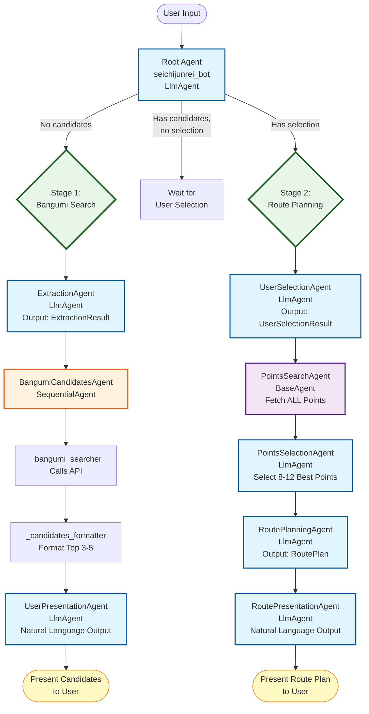

# Seichijunrei Agent Architecture Documentation

## Table of Contents

- [Overview](#overview)
- [System Architecture](#system-architecture)
- [Agent Types](#agent-types)
- [Two-Stage Conversation Flow](#two-stage-conversation-flow)
- [Session State Management](#session-state-management)
- [Data Flow](#data-flow)
- [Architecture Diagrams](#architecture-diagrams)
- [Key Design Principles](#key-design-principles)
- [File Structure](#file-structure)

---

## Overview

Seichijunrei is an intelligent anime pilgrimage route planning system built on Google's Agent Development Kit (ADK). The system helps users discover anime titles related to specific locations and generates optimized pilgrimage routes to visit key scenes from their selected anime.

### Key Features

- **Multilingual Support**: Handles Chinese, English, and Japanese input/output
- **Intelligent Search**: Uses Bangumi API to find anime related to locations
- **Smart Point Selection**: LLM-powered selection of 8-12 best pilgrimage points
- **Route Optimization**: Generates practical, time-efficient routes
- **Two-Stage Flow**: Natural conversational experience with candidate presentation and selection

### Technology Stack

- **Framework**: Google ADK (Agent Development Kit)
- **LLM**: Gemini 2.0 Flash
- **APIs**: Bangumi, Anitabi
- **Language**: Python 3.11+

---

## System Architecture

The Seichijunrei system implements a **hierarchical agent architecture** with conditional routing and state-based conversation flow.

### High-Level Architecture

```
┌─────────────────────────────────────────────────────────────┐
│                       User Interface                         │
└─────────────────────┬───────────────────────────────────────┘
                      │
                      ▼
┌─────────────────────────────────────────────────────────────┐
│                     Root Agent                               │
│               (Conditional Router)                           │
└───────┬─────────────────────────────────┬───────────────────┘
        │                                 │
        ▼                                 ▼
┌──────────────────┐           ┌──────────────────────┐
│  Stage 1 Flow    │           │   Stage 2 Flow       │
│ Bangumi Search   │           │  Route Planning      │
└──────────────────┘           └──────────────────────┘
        │                                 │
        ▼                                 ▼
┌──────────────────┐           ┌──────────────────────┐
│ Session State    │◄──────────┤  Session State       │
│  Management      │           │   Management         │
└──────────────────┘           └──────────────────────┘
```

### Agent Hierarchy

The system consists of **10 distinct agents** organized into 2 main workflows:

#### Root Level
- **Root Agent** (`seichijunrei_bot`): Entry point and conditional router

#### Stage 1: Bangumi Search Workflow
1. **ExtractionAgent**: Extracts user intent (bangumi name, location, language)
2. **BangumiCandidatesAgent**: Sequential agent with two sub-components:
   - `_bangumi_searcher`: Calls Bangumi API
   - `_candidates_formatter`: Formats top 3-5 results
3. **UserPresentationAgent**: Generates natural language output

#### Stage 2: Route Planning Workflow
4. **UserSelectionAgent**: Parses user's anime selection
5. **PointsSearchAgent**: Fetches all pilgrimage points from Anitabi API
6. **PointsSelectionAgent**: Intelligently selects 8-12 best points
7. **RoutePlanningAgent**: Generates optimized route plan
8. **RoutePresentationAgent**: Converts route to natural language

---

## Agent Types

The system uses three types of ADK agents:

### 1. LlmAgent

**Purpose**: Agents that use LLM reasoning for structured output or natural language generation

**Characteristics**:
- Can have `output_schema` for structured data
- Can have `tools` for external function calls (not recommended with output_schema)
- Used for reasoning, extraction, and presentation tasks

**Examples**:
- `ExtractionAgent`: Outputs `ExtractionResult` schema
- `UserPresentationAgent`: Outputs natural language text
- `PointsSelectionAgent`: Uses LLM reasoning to select best points

### 2. SequentialAgent

**Purpose**: Orchestrates multiple sub-agents in sequence

**Characteristics**:
- Executes agents in defined order
- Passes output from one agent to the next
- Used for multi-step workflows

**Examples**:
- `BangumiCandidatesAgent`: Chains searcher and formatter
- `BangumiSearchWorkflow`: Chains extraction, search, and presentation
- `RoutePlanningWorkflow`: Chains all Stage 2 agents

### 3. BaseAgent

**Purpose**: Custom async agents for specialized tasks

**Characteristics**:
- Full control over execution logic
- Direct async/await implementation
- Used for complex API interactions

**Examples**:
- `PointsSearchAgent`: Custom async implementation for Anitabi API

---

## Two-Stage Conversation Flow

### Stage 1: Bangumi Search

**Trigger**: User's first message (no `bangumi_candidates` in session)

**Process**:
1. Extract user intent (anime name, location, language)
2. Search Bangumi API for matching anime
3. Format and rank top 3-5 candidates
4. Present options to user in their language

**Output**: Natural language presentation of anime candidates

**Example**:
```
User: "我想去镰仓圣地巡礼"
Bot: "找到 3 部与 '镰仓' 相关的动画作品，请选择：
     1. 灌篮高手 (スラムダンク，1993-10)
     2. TARI TARI（2012-07）
     3. 青春猪头少年不会梦到兔女郎学姐（青春ブタ野郎はバニーガール先輩の夢を見ない，2018-10）
     请回复数字（如 '1'）选择第一部作品。"
```

### Stage 2: Route Planning

**Trigger**: User provides selection (automatically when `bangumi_candidates` exists in session)

**Process**:
1. Parse user's selection with confidence scoring (UserSelectionAgent)
2. Fetch ALL pilgrimage points from Anitabi API (PointsSearchAgent)
3. LLM selects 8-12 best points considering feasibility and importance (PointsSelectionAgent)
4. Generate optimized route using SimpleRoutePlanner (RoutePlanningAgent)
5. Present route with detailed descriptions (RoutePresentationAgent)

**Output**: Natural language route description with practical information

**Example**:
```
User: "1"
Bot: "为您规划了镰仓《灌篮高手》（スラムダンク）圣地巡礼路线：

     推荐顺序：
     1. 镰仓高校前站 - 经典的铁道口场景 (第1话)
     2. 湘南海岸 - 樱木花道练习的海滩 (第3话)
     ...

     预计用时：约 5.0 小时
     预计距离：约 12 公里

     交通提示：
     利用江之电沿线游览，大部分地点步行可达。"
```

### Automatic Routing Logic

The Root Agent acts as a pure router, automatically triggering workflows based on session state:

```python
if session_state.bangumi_candidates is None:
    # Execute Stage 1: Bangumi Search
    # → ExtractionAgent, BangumiCandidatesAgent, UserPresentationAgent
    return bangumi_search_workflow

# Execute Stage 2: Route Planning
# → UserSelectionAgent parses selection automatically
# → PointsSearchAgent, PointsSelectionAgent, RoutePlanningAgent, RoutePresentationAgent
return route_planning_workflow
```

---

## Session State Management

### State Variables

The system maintains the following key state variables throughout the conversation:

| Variable | Type | Set By | Used By | Description |
|----------|------|--------|---------|-------------|
| `extraction_result` | `ExtractionResult` | ExtractionAgent | All agents | User intent extraction |
| `bangumi_candidates` | `BangumiCandidatesResult` | BangumiCandidatesAgent | UserPresentationAgent, UserSelectionAgent | List of anime options |
| `selected_bangumi` | `UserSelectionResult` | UserSelectionAgent | PointsSearchAgent | User's chosen anime |
| `all_points` | List | PointsSearchAgent | PointsSelectionAgent | All pilgrimage points |
| `points_selection_result` | `PointsSelectionResult` | PointsSelectionAgent | RoutePlanningAgent | Filtered points |
| `route_plan` | `RoutePlan` | RoutePlanningAgent | RoutePresentationAgent | Optimized route |

### State Lifecycle

See [State Diagram](./architecture/state_diagram.md) for detailed state transitions.

### Session Persistence

- **Service**: `InMemorySessionService` from Google ADK
- **Scope**: Session state persists across multiple user messages
- **Access**: All agents can read/write to session state via context

---

## Data Flow

### Overall Data Flow Diagram

```
User Input
    ↓
[ExtractionAgent]
    ↓
{bangumi_name, location, user_language} → Session State
    ↓
[BangumiSearcher + Formatter]
    ↓
{candidates list} → Session State
    ↓
[UserPresentation]
    ↓
Natural Language → User
    ↓
User Selection Input
    ↓
[UserSelectionAgent]
    ↓
{selected_bangumi} → Session State
    ↓
[PointsSearchAgent]
    ↓
{all_points} → Session State
    ↓
[PointsSelectionAgent]
    ↓
{8-12 selected points} → Session State
    ↓
[RoutePlanningAgent]
    ↓
{route_plan} → Session State
    ↓
[RoutePresentationAgent]
    ↓
Natural Language Route → User
```

### Data Schemas

All data schemas are defined in `adk_agents/seichijunrei_bot/_schemas.py`:

- `ExtractionResult`: User intent extraction
- `BangumiCandidatesResult`: Anime search results
- `UserSelectionResult`: User's anime selection
- `PointsSelectionResult`: Selected pilgrimage points
- `RoutePlan`: Optimized route structure

---

## Architecture Diagrams

### 1. Agent Interaction Flow

Visual representation of how agents interact and pass data.

**View**: [docs/architecture/agent_flow.md](./architecture/agent_flow.md)



### 2. Sequence Diagram

Detailed message passing and timing between agents.

**View**: [docs/architecture/agent_sequence.puml](./architecture/agent_sequence.puml)

**Generate PNG**:
```bash
plantuml docs/architecture/agent_sequence.puml
```

### 3. State Transition Diagram

Session state lifecycle and transitions.

**View**: [docs/architecture/state_diagram.md](./architecture/state_diagram.md)

### 4. Interactive Visualization

Click and explore the agent architecture interactively.

**View**: Open [docs/architecture/interactive_flow.html](./architecture/interactive_flow.html) in your browser

**Features**:
- Click nodes to see detailed agent information
- Zoom and pan to explore
- Color-coded by agent type
- Shows all data flows and dependencies

---

## Key Design Principles

### 1. Separation of Concerns

**Structured Output Agents**:
- Use `output_schema` parameter
- Focus on data extraction and transformation
- No tools attached (ADK best practice)

**Presentation Agents**:
- No `output_schema`
- Generate natural language
- Use translation tools for multilingual support

**API Integration Agents**:
- BaseAgent for complex async operations
- Handle external API calls
- Transform raw API responses

### 2. ADK Best Practices

**Avoid Tools + output_schema Combination**:
```python
# ❌ Bad: Tools + output_schema in same agent
agent = LlmAgent(
    tools=[search_tool],
    output_schema=SearchResult  # Conflict!
)

# ✓ Good: Separate concerns
searcher = LlmAgent(tools=[search_tool])
formatter = LlmAgent(output_schema=SearchResult)
workflow = SequentialAgent(agents=[searcher, formatter])
```

**Use SequentialAgent for Workflows**:
- Chain related agents
- Clear execution order
- Automatic state propagation

**State Management**:
- All state in session
- Explicit state variables
- Read from session, write to session

### 3. Multilingual Support Strategy

**Language Detection**:
- Extract user language in ExtractionAgent
- Store in session state
- Use throughout conversation

**Title Format**:
- Primary: User's language title
- Secondary: Japanese original in parentheses
- Example: "灌篮高手 (スラムダンク)"

**Translation Tool**:
- Used by presentation agents
- Fallback for missing translations
- Consistent format across responses

### 4. Intelligent Point Selection

**Two-Step Filtering**:
1. **Fetch All**: PointsSearchAgent gets complete dataset
2. **LLM Selection**: PointsSelectionAgent uses reasoning to pick best 8-12

**Selection Criteria**:
- Geographic feasibility (clustering, accessibility)
- Story importance (key scenes, fan favorites)
- Visit feasibility (accessibility, public access)

**Benefits**:
- Better than keyword filtering
- Contextual understanding
- Rationale for each selection

---

## File Structure

```
adk_agents/seichijunrei_bot/
├── agent.py                          # Root agent definition
├── _schemas.py                       # All Pydantic schemas
│
├── _agents/                          # Individual agent definitions
│   ├── extraction_agent.py          # Stage 1: Intent extraction
│   ├── bangumi_candidates_agent.py  # Stage 1: Search + format
│   ├── user_presentation_agent.py   # Stage 1: Present candidates
│   ├── user_selection_agent.py      # Stage 2: Parse selection
│   ├── points_search_agent.py       # Stage 2: Fetch points
│   ├── points_selection_agent.py    # Stage 2: Select best points
│   ├── route_planning_agent.py      # Stage 2: Plan route
│   └── route_presentation_agent.py  # Stage 2: Present route
│
├── _workflows/                       # Workflow compositions
│   ├── bangumi_search_workflow.py   # Stage 1 workflow
│   └── route_planning_workflow.py   # Stage 2 workflow
│
├── tools/                            # Custom tools
│   ├── __init__.py                  # Tool exports
│   ├── route_planning.py            # Route planning tool
│   └── translation.py               # Translation tool
│
├── services/                         # Business logic
│   ├── bangumi_service.py           # Bangumi API client
│   ├── anitabi_service.py           # Anitabi API client
│   └── route_planner.py             # Route optimization
│
└── .adk/                             # ADK configuration
    └── eval_history/                 # Evaluation results
```

---

## Development

### Running the Agent

```bash
# Install dependencies
uv sync

# Run agent locally
adk dev

# Run with specific session
adk dev --session-id my-session
```

### Generating Architecture Diagrams

```bash
# Run the diagram generator
python3 generate_architecture_diagram.py

# Output will be in docs/architecture/
```

### Testing

```bash
# Run all tests
pytest

# Run specific test file
pytest tests/agents/test_extraction_agent.py

# Run with ADK evaluation
adk eval --evalset *.evalset.json
```

---

## References

### External Documentation

- [Google ADK Documentation](https://ai.google.dev/adk)
- [Bangumi API](https://bangumi.github.io/api/)
- [Anitabi API](https://navi.anitabi.cn/docs)

### Internal Documentation

- [README.md](../README.md) - Project overview and setup
- [DEPLOYMENT.md](./DEPLOYMENT.md) - Deployment guide
- [Agent Flow Diagram](./architecture/agent_flow.md)
- [Sequence Diagram](./architecture/agent_sequence.puml)
- [State Diagram](./architecture/state_diagram.md)
- [Interactive Visualization](./architecture/interactive_flow.html)

---

## Changelog

### Version 1.0.0 (Current)
- Initial architecture documentation
- Complete agent system with 10 agents
- Two-stage conversation flow
- Multilingual support (CN, EN, JP)
- Intelligent point selection with LLM reasoning
- Route optimization

---

**Last Updated**: 2025-12-01
**Maintained By**: Zhenjia Zhou
