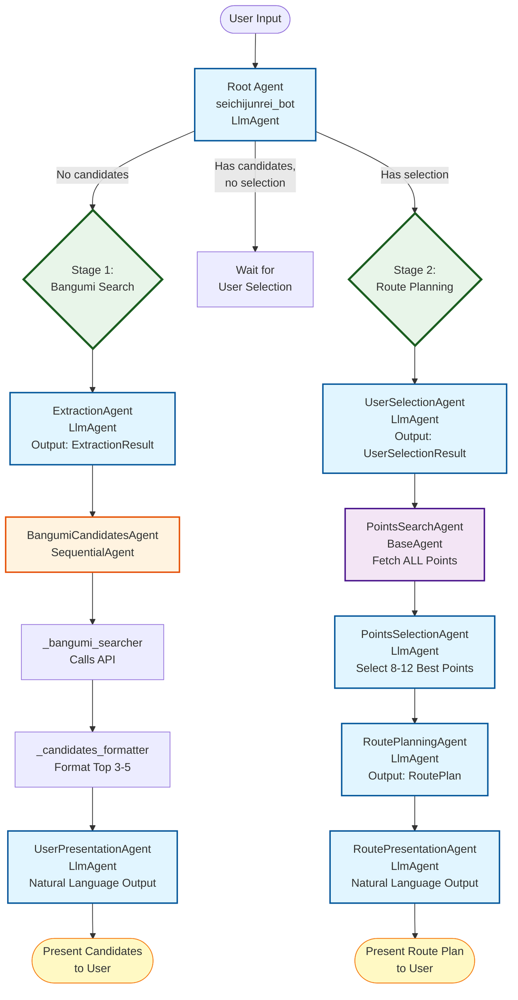

# Seichijunrei Agent Architecture - Interaction Flow

```mermaid
flowchart TD
    %% Seichijunrei Agent Architecture - Interaction Flow

    classDef llmAgent fill:#e1f5ff,stroke:#01579b,stroke-width:2px
    classDef seqAgent fill:#fff3e0,stroke:#e65100,stroke-width:2px
    classDef baseAgent fill:#f3e5f5,stroke:#4a148c,stroke-width:2px
    classDef workflow fill:#e8f5e9,stroke:#1b5e20,stroke-width:3px
    classDef schema fill:#fff9c4,stroke:#f57f17,stroke-width:1px

    Start([User Input]) --> RootAgent[Root Agent<br/>seichijunrei_bot<br/>LlmAgent]
    RootAgent -->|No candidates| Stage1{Stage 1:<br/>Bangumi Search}
    RootAgent -->|Has candidates,<br/>no selection| Wait[Wait for<br/>User Selection]
    RootAgent -->|Has selection| Stage2{Stage 2:<br/>Route Planning}

    Stage1 --> ExtractionAgent[ExtractionAgent<br/>LlmAgent<br/>Output: ExtractionResult]
    ExtractionAgent --> BangumiCandidates[BangumiCandidatesAgent<br/>SequentialAgent]
    BangumiCandidates --> BangumiSearcher[_bangumi_searcher<br/>Calls API]
    BangumiSearcher --> BangumiFormatter[_candidates_formatter<br/>Format Top 3-5]
    BangumiFormatter --> UserPresentation[UserPresentationAgent<br/>LlmAgent<br/>Natural Language Output]
    UserPresentation --> Output1([Present Candidates<br/>to User]):::schema

    Stage2 --> UserSelection[UserSelectionAgent<br/>LlmAgent<br/>Output: UserSelectionResult]
    UserSelection --> PointsSearch[PointsSearchAgent<br/>BaseAgent<br/>Fetch ALL Points]
    PointsSearch --> PointsSelection[PointsSelectionAgent<br/>LlmAgent<br/>Select 8-12 Best Points]
    PointsSelection --> RoutePlanning[RoutePlanningAgent<br/>LlmAgent<br/>Output: RoutePlan]
    RoutePlanning --> RoutePresentation[RoutePresentationAgent<br/>LlmAgent<br/>Natural Language Output]
    RoutePresentation --> Output2([Present Route Plan<br/>to User]):::schema

    class ExtractionAgent,UserPresentation,UserSelection,PointsSelection,RoutePlanning,RoutePresentation,RootAgent llmAgent
    class BangumiCandidates seqAgent
    class PointsSearch baseAgent
    class Stage1,Stage2 workflow

```