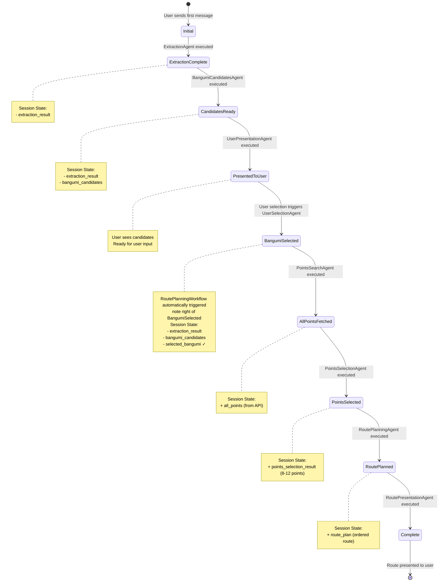

# Seichijunrei Session State - Lifecycle Diagram

```mermaid
stateDiagram-v2
    [*] --> Initial: User sends first message
    
    Initial --> ExtractionComplete: ExtractionAgent executed
    note right of ExtractionComplete
        Session State:
        - extraction_result
    end note
    
    ExtractionComplete --> CandidatesReady: BangumiCandidatesAgent executed
    note right of CandidatesReady
        Session State:
        - extraction_result
        - bangumi_candidates
    end note
    
    CandidatesReady --> PresentedToUser: UserPresentationAgent executed
    note right of PresentedToUser
        User sees candidates
        Ready for user input
    end note

    PresentedToUser --> BangumiSelected: User selection triggers UserSelectionAgent
    note right of BangumiSelected
        RoutePlanningWorkflow automatically triggered
    note right of BangumiSelected
        Session State:
        - extraction_result
        - bangumi_candidates
        - selected_bangumi ✓
    end note
    
    BangumiSelected --> AllPointsFetched: PointsSearchAgent executed
    note right of AllPointsFetched
        Session State:
        + all_points (from API)
    end note
    
    AllPointsFetched --> PointsSelected: PointsSelectionAgent executed
    note right of PointsSelected
        Session State:
        + points_selection_result (8-12 points)
    end note
    
    PointsSelected --> RoutePlanned: RoutePlanningAgent executed
    note right of RoutePlanned
        Session State:
        + route_plan (ordered route)
    end note
    
    RoutePlanned --> Complete: RoutePresentationAgent executed
    Complete --> [*]: Route presented to user
```